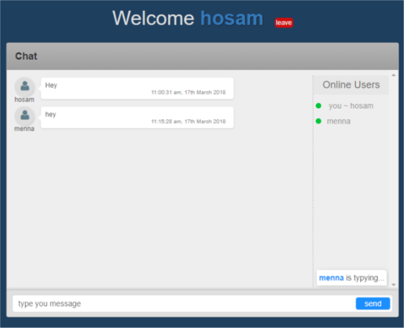

# Building a Website with Node & ExpressJS
---

view the website on the [link](https://pure-ravine-76563.herokuapp.com/)

this website uses `nodejs`,`express`, `mongodb`,`socket.io`,`bootstrap`

to get you a copy of the project 

first you got to clone it `git clone https://github.com/hosamsam/RoaxAcademy-express.git`

then `cd RoaxAcademy-express && npm install`

and run `npm run dev:mon` server will be listen on port `3000` by default

## live chat tab

